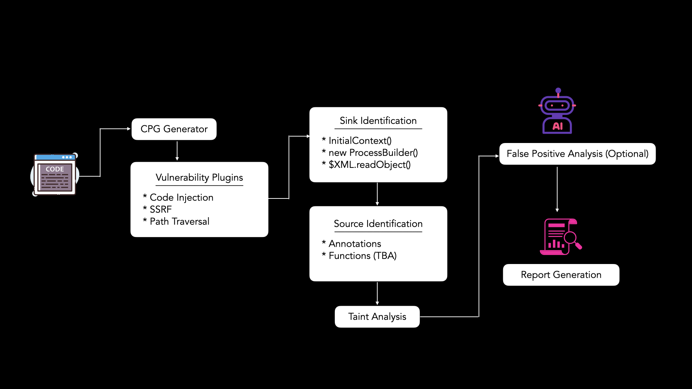

<div align="center">

# Nika

### Open-Source Static Application Security Testing (SAST) tool with cross-file taint analysis

<em>Trace attacker-controlled input from source to sink across your Java microservices.</em>

<br/>

[](https://discord.com/invite/PrTJ5Hubfm)
&nbsp;
[](https://phonepe.github.io/nika/)

<br/>


&nbsp;

&nbsp;

&nbsp;


<br/>

**[Quick Start](#quick-start)** · **[Why Nika](#why-nika)** · **[Detection Coverage](#detection-coverage)** · **[How It Works](#how-nika-works)** · **[Docs](https://phonepe.github.io/nika/)**

<br/>

</div>


Nika is an open-source source code review and static analysis tool for security engineers who need to identify exploit paths in Java microservices. It performs cross-file taint analysis to trace attacker-controlled input across application layers and determine whether that input reaches a security-sensitive sink.

## Why Nika

Many exploitable issues are not visible inside a single file. Request data may enter through a controller, pass through DTOs and service layers, and only become dangerous when it reaches a sink such as a database query, file operation, template engine, reflection API, or outbound network call.

Nika is built for that review problem. Instead of just identifying dangerous sinks, it traces data flow across files and functions so security engineers can determine whether a path is actually reachable.

## What Nika Helps Security Engineers Do

- Trace attacker-controlled input across controllers, services, helpers, and utility layers.
- Validate source-to-sink reachability.
- Support secure code review with branch-aware scanning.
- Generate HTML reports.
- Extend coverage with custom sources, OpenGrep sinks, and vulnerability plugins.

## Detection Coverage

Nika currently supports the following vulnerability categories:

- SQL injection
- SSRF
- Path traversal
- Command injection
- Code injection
- Template injection
- Deserialization
- XXE
- Cryptographic failures
- Unsafe reflection
- Security-critical call-order violations in sensitive execution flows and validation chains

## How Nika Works

At a high level, Nika follows this analysis flow:



1. Process the target repository into an analysis representation that captures code structure, control flow, and data flow.
2. Identify configured sources where attacker-controlled input enters the application.
3. Identify sinks that represent security-sensitive operations.
4. Perform cross-file and inter-procedural analysis to determine whether input can reach those sinks.
5. Optionally review vulnerability with AI Agent to reduce false positives.
6. Produce an HTML report with the vulnerable path, affected code locations, and remediation context.

## Quick Start

### Run via Docker

You can use pre-built docker images.

```bash
git clone https://github.com/PhonePe/nika.git
docker pull ghcr.io/phonepe/nika:latest
export NIKA_IMAGE=ghcr.io/phonepe/nika
./run.sh --path /absolute/path/to/code --config /absolute/path/to/crtConfig.yml --output ./report.html
```
> You still need to clone the repository after pulling the image, since `run.sh` makes it easier to run Nika by handling multiple mounts for you.

or build a docker image yourself.

```bash
git clone https://github.com/PhonePe/nika.git
cd nika
./build.sh
./run.sh --path /absolute/path/to/code --config /absolute/path/to/crtConfig.yml --output ./report.html
```

### Run locally

```bash
git clone https://github.com/PhonePe/nika.git
cd nika
./native-build.sh
./native-run.sh --path /absolute/path/to/code --output ./report.html
```

## Enable AI based False Positive Analysis

* Docker Setup - You can modify the config at `/absolute/path/to/crtConfig.yml`.
* Local Setup - You can modify the config at `/absolute/path/to/native-crtConfig.yml`.

```yaml
LLMConfig:
  API_KEY: 'API_TOKEN'
  LLM_URL: 'https://chatgpt.com/api/v1'
  MODEL: 'GPT-5'
  MAX_TOOL_CALLS: 10
  MAX_ITERATIONS: 15
  RECURSION_LIMIT: 100
  PROMPT_COST_PER_MILLION: 1.25
  COMPLETION_COST_PER_MILLION: 10.0

llm_review_enabled: false
```

### Documentation

To know more about Nika and it's features, you can read our detailed documentation [here](https://phonepe.github.io/nika/index.html).

## Language Support

Java is the only fully supported language today; support for other languages remains planned.

## Contributors

<p align="center">
  <a href="https://github.com/PhonePe/nika/graphs/contributors">
    
  </a>
  <a href="https://github.com/pachinko2821">
    
  </a>
  <a href="https://github.com/wisdomfreak-1">
    
  </a>
  <a href="https://github.com/riti-ka-7">
    
  </a>
</p>